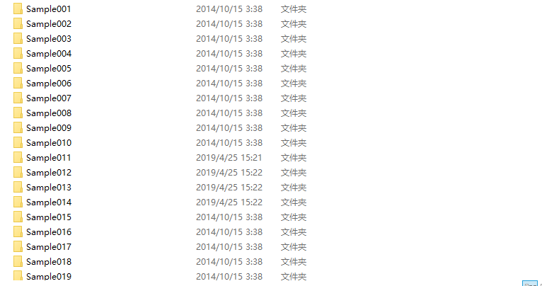
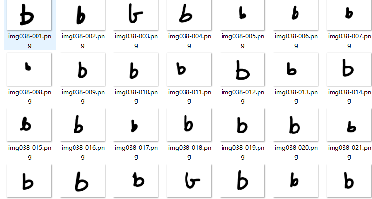

# 基于HOG特征的手写字母识别
本项目采用的是Chars74K数据集。该数据集包含手写数字，字母已经印刷版字母等。本项目通过提取特征的C++代码，进行数据集采集，选用的是图像的HOG特征，
将存放的特征信息存放在txt文件中，接着使用的mathlab建立ANN，进行图像识别，正确率在80%左右。为了测试训练好的神经网络的准确性，又做了一个mathlab的测试
程序，通过调用tiqu文件夹中的提取图像信息的程序，提取图像特征，然后通过mathlab进行识别，效果尚且可以。Chars74是一个不错的手写数字和字母的数据集，给大家
强烈推荐一下，可以去网上下载，也可以私信我，fty_cs@foxmail.com

